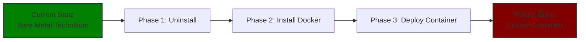

# technitium-docker-migration

## 📖 Project Overview

This repository documents the complete migration of Technitium DNS from a bare metal installation on Raspberry Pi OS Lite 64-bit to a Docker container. The goal is to containerize the DNS service for easier management, better resource isolation, and to establish a foundation for running multiple services on the same server.

## 🏗️ Migration Architecture



## 📋 Project Phases

### Phase 1: Uninstall Bare Metal Installation
- [ ] Stop Technitium service
- [ ] Run uninstall script
- [ ] Verify port 53 is free

### Phase 2: Install Docker Engine
- [ ] Update system packages
- [ ] Install Docker using convenience script
- [ ] Add user to docker group
- [ ] Verify installation with `hello-world`

### Phase 3: Deploy Technitium in Docker
- [ ] Create docker-compose.yml
- [ ] Configure environment variables
- [ ] Deploy container
- [ ] Test DNS resolution

## 🚀 Quick Start

### Prerequisites
- Raspberry Pi 4/5 (4GB+ RAM recommended)
- Raspberry Pi OS Lite 64-bit installed
- SSH access to your Raspberry Pi
- Basic Linux command-line familiarity

### Step 1: Uninstall Existing Technitium
Stop the service and run the official uninstall script.

```bash
sudo systemctl stop technitiumdns
curl -sSL https://download.technitium.com/dns/install | sudo bash /dev/stdin uninstall
```

### Step 2: Install Docker
Update your system and install Docker Engine.

```bash
sudo apt update && sudo apt upgrade -y
curl -fsSL https://get.docker.com -o get-docker.sh
sudo sh get-docker.sh
sudo usermod -aG docker $USER
```

*Note: You will need to log out and log back in for the docker group changes to take effect.*

### Step 3: Deploy Technitium Container
Clone this repository and start the container.

```bash
git clone https://github.com/YOUR_USERNAME/technitium-docker-migration.git
cd technitium-docker-migration
cp .env.example .env
nano .env
docker-compose up -d
```

## ⚙️ Configuration

### Environment Variables
Create a `.env` file based on `.env.example` with the following variables:

| Variable | Description | Default |
|----------|-------------|---------|
| `ADMIN_PASSWORD` | Technitium web interface password | `changeme` |
| `DNS_SERVERS` | Upstream DNS servers | `1.1.1.1,8.8.8.8` |

### Docker Compose File
The `docker-compose.yml` used for this deployment:

```yaml
version: '3.8'

services:
  technitium-dns:
    image: technitium/dns-server:latest
    container_name: technitium-dns
    restart: unless-stopped
    ports:
      - "5380:5380"
      - "53:53/udp"
      - "53:53/tcp"
    volumes:
      - ./config:/etc/technitiumdns/config
      - technitium-data:/var/lib/technitiumdns
    environment:
      - ADMIN_PASSWORD=${ADMIN_PASSWORD}
    networks:
      - dns-network

networks:
  dns-network:
    driver: bridge

volumes:
  technitium-data:
```

## 🧪 Testing & Verification

Use these commands to verify your DNS server is working correctly. (If `dig` is not installed, run `sudo apt install dnsutils`).

```bash
# Test DNS resolution
dig @localhost google.com +short

# Test container specifically
docker exec technitium-dns dig @localhost google.com +short

# Check container status
docker ps

# View container logs
docker logs technitium-dns
```

## 📊 Resource Usage Comparison

| Metric | Bare Metal | Docker Container | Difference |
|--------|------------|------------------|------------|
| CPU Usage | *e.g., 2.1%* | *e.g., 1.8%* | *-0.3%* |
| Memory Usage | *e.g., 85MB* | *e.g., 95MB* | *+10MB* |
| DNS Response Time | *e.g., 15ms* | *e.g., 18ms* | *+3ms* |
| Startup Time | *e.g., 2.1s* | *e.g., 1.8s* | *-0.3s* |

## 📸 Screenshots & Visuals

### Architecture Comparison

*Side-by-side comparison of Bare Metal vs Docker architecture*

### Web Interface

*Technitium DNS web interface running in Docker*

### Container Status

*Container running successfully with correct port mappings*

## 🚨 Troubleshooting

<details>
<summary>Click to expand troubleshooting guide</summary>

### `dig: command not found`
Install the dnsutils package:
```bash
sudo apt install dnsutils
```

### Read-only warning messages during dnsutils install


These warning messages indicate that your Raspberry Pi's filesystem is currently set to **"read-only"**. This means the system is protecting itself from writing any new data to the SD card. 

This is a common issue on Raspberry Pis and usually happens for one of three reasons:
1. The system detected an SD card error and automatically remounted the drive as read-only to prevent data corruption.
2. The Pi was not shut down cleanly (e.g., power was pulled unexpectedly).
3. You have an overlay filesystem enabled (sometimes used in kiosk setups).

Here is how to fix it and get your packages installed:

#### Step 1: Remount the Filesystem as Read-Write
Run this command to tell the system to allow writes again:

```bash
sudo mount -o remount,rw /
```

#### Step 2: Update and Install Again
Now that the filesystem is writable, try updating your package list and installing the package again:

```bash
sudo apt update
sudo apt install dnsutils
```

#### Step 3: Investigate the Root Cause (Important!)
If the command worked, your system is temporarily fixed, but you need to figure out *why* it happened so it doesn't happen again.

**Check your filesystem health:**
Run a disk check on your SD card to see if it has errors:
```bash
sudo dmesg | grep -i "error\|ext4\|readonly"
```
If you see a lot of red text or ext4 errors, your SD card might be failing or corrupted.

**The best fix:**
If you see errors, the safest route is to:
1. Back up any important configs (like your Technitium config folder, if you haven't already).
2. Reflash your Raspberry Pi OS Lite 64-bit onto the SD card (or a new SD card) using the Raspberry Pi Imager.
3. Start the Docker migration fresh on a clean, healthy OS.

If you *don't* see any errors after running the `dmesg` command, it might have just been a one-off glitch. Reboot the Pi normally:
```bash
sudo reboot
```

Once it comes back online, try `sudo apt install dnsutils` one more time to ensure it persists across reboots!

### Port 53 already in use
Check what is using port 53 and stop it:
```bash
sudo netstat -tulnp | grep :53
sudo systemctl stop systemd-resolved
```

### Container won't start
Check the logs for errors:
```bash
docker logs technitium-dns
```

### Warning: Remote Host Identification has Changed
Don't worry! This is a completely normal and common error. Because you reflashed the SD card with a fresh operating system, your Raspberry Pi generated a brand new set of SSH security keys. 

Your Windows 11 PC still remembers the *old* security keys from your previous installation and is correctly warning you that the server's identity has changed. Since you just reinstalled the OS, we know it's safe.

Here is how to fix it on your Windows 11 PC:

### Step 1: Open PowerShell on your Windows 11 PC
You can use the same PowerShell window where you got the error, or open a new one.

### Step 2: Remove the old SSH key
Run the following command to tell your PC to forget the old key for that IP address:

```bash
ssh-keygen -R 192.168.86.10
```

You should see a message saying something like `# Host 192.168.86.10 found: line 8...` and `Updated C:\Users\rzieh/.ssh/known_hosts successfully.`

### Step 3: Connect again
Now, try to SSH into your Pi again:

```bash
ssh pi@192.168.86.10
```

### Step 4: Accept the new fingerprint
Because your PC forgot the old key, it will now see the Pi's *new* key. You will be prompted with a message like this:

```text
The authenticity of host '192.168.86.10 (192.168.86.10)' can't be established.
ED25519 key fingerprint is SHA256:/Siyugo+5FzEFRvoT4kHj4Tm0SwaQtUjGdiOuaq2Rrs.
Are you sure you want to continue connecting (yes/no/[fingerprint])?
```

Type **`yes`** and press Enter. 

You should now be successfully logged into your fresh Raspberry Pi OS! You can proceed with installing Docker and getting your containers set up.

</details>

## 🔗 Related Repositories

This project builds upon the initial bare metal installation:
- **[Technitium DNS Server (Bare Metal)](https://github.com/YOUR_USERNAME/technitium-dns-server)** - Original installation and configuration documentation

## 📈 Future Enhancements

- [ ] Add automated backup solution
- [ ] Implement monitoring with Prometheus/Grafana
- [ ] Add Pi-hole or AdGuard Home as a secondary DNS
- [ ] Create CI/CD pipeline for configuration changes

## 📄 License

This project is licensed under the MIT License - see the [LICENSE](LICENSE) file for details.
```
