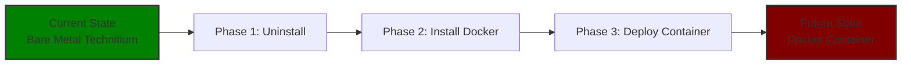

# technitium-docker-migration

```markdown
# 🐳 Technitium DNS: Bare Metal to Docker Migration


```

## 📖 Project Overview

This repository documents the complete migration of Technitium DNS from a bare metal installation on Raspberry Pi OS Lite 64-bit to a Docker container. The goal is to containerize the DNS service for easier management, better resource isolation, and to establish a foundation for running multiple services on the same server.

## 🏗️ Migration Architecture



## 📋 Project Phases

### Phase 1: Uninstall Bare Metal Installation
- [ ] Stop Technitium service
- [ ] Run uninstall script
- [ ] Verify port 53 is free

### Phase 2: Install Docker Engine
- [ ] Update system packages
- [ ] Install Docker using convenience script
- [ ] Add user to docker group
- [ ] Verify installation with `hello-world`

### Phase 3: Deploy Technitium in Docker
- [ ] Create docker-compose.yml
- [ ] Configure environment variables
- [ ] Deploy container
- [ ] Test DNS resolution

## 🚀 Quick Start

### Prerequisites
- Raspberry Pi 4/5 (4GB+ RAM recommended)
- Raspberry Pi OS Lite 64-bit installed
- SSH access to your Raspberry Pi
- Basic Linux command-line familiarity

### Step 1: Uninstall Existing Technitium
Stop the service and run the official uninstall script.

```bash
sudo systemctl stop technitiumdns
curl -sSL https://download.technitium.com/dns/install | sudo bash /dev/stdin uninstall
```

### Step 2: Install Docker
Update your system and install Docker Engine.

```bash
sudo apt update && sudo apt upgrade -y
curl -fsSL https://get.docker.com -o get-docker.sh
sudo sh get-docker.sh
sudo usermod -aG docker $USER
```

*Note: You will need to log out and log back in for the docker group changes to take effect.*

### Step 3: Deploy Technitium Container
Clone this repository and start the container.

```bash
git clone https://github.com/YOUR_USERNAME/technitium-docker-migration.git
cd technitium-docker-migration
cp .env.example .env
nano .env
docker-compose up -d
```

## ⚙️ Configuration

### Environment Variables
Create a `.env` file based on `.env.example` with the following variables:

| Variable | Description | Default |
|----------|-------------|---------|
| `ADMIN_PASSWORD` | Technitium web interface password | `changeme` |
| `DNS_SERVERS` | Upstream DNS servers | `1.1.1.1,8.8.8.8` |

### Docker Compose File
The `docker-compose.yml` used for this deployment:

```yaml
version: '3.8'

services:
  technitium-dns:
    image: technitium/dns-server:latest
    container_name: technitium-dns
    restart: unless-stopped
    ports:
      - "5380:5380"
      - "53:53/udp"
      - "53:53/tcp"
    volumes:
      - ./config:/etc/technitiumdns/config
      - technitium-data:/var/lib/technitiumdns
    environment:
      - ADMIN_PASSWORD=${ADMIN_PASSWORD}
    networks:
      - dns-network

networks:
  dns-network:
    driver: bridge

volumes:
  technitium-data:
```

## 🧪 Testing & Verification

Use these commands to verify your DNS server is working correctly. (If `dig` is not installed, run `sudo apt install dnsutils`).

```bash
# Test DNS resolution
dig @localhost google.com +short

# Test container specifically
docker exec technitium-dns dig @localhost google.com +short

# Check container status
docker ps

# View container logs
docker logs technitium-dns
```

## 📊 Resource Usage Comparison

| Metric | Bare Metal | Docker Container | Difference |
|--------|------------|------------------|------------|
| CPU Usage | *e.g., 2.1%* | *e.g., 1.8%* | *-0.3%* |
| Memory Usage | *e.g., 85MB* | *e.g., 95MB* | *+10MB* |
| DNS Response Time | *e.g., 15ms* | *e.g., 18ms* | *+3ms* |
| Startup Time | *e.g., 2.1s* | *e.g., 1.8s* | *-0.3s* |

## 📸 Screenshots & Visuals

### Architecture Comparison

*Side-by-side comparison of Bare Metal vs Docker architecture*

### Web Interface

*Technitium DNS web interface running in Docker*

### Container Status

*Container running successfully with correct port mappings*

## 🚨 Troubleshooting

<details>
<summary>Click to expand troubleshooting guide</summary>

### `dig: command not found`
Install the dnsutils package:
```bash
sudo apt install dnsutils
```

### Port 53 already in use
Check what is using port 53 and stop it:
```bash
sudo netstat -tulnp | grep :53
sudo systemctl stop systemd-resolved
```

### Container won't start
Check the logs for errors:
```bash
docker logs technitium-dns
```

</details>

## 🔗 Related Repositories

This project builds upon the initial bare metal installation:
- **[Technitium DNS Server (Bare Metal)](https://github.com/YOUR_USERNAME/technitium-dns-server)** - Original installation and configuration documentation

## 📈 Future Enhancements

- [ ] Add automated backup solution
- [ ] Implement monitoring with Prometheus/Grafana
- [ ] Add Pi-hole or AdGuard Home as a secondary DNS
- [ ] Create CI/CD pipeline for configuration changes

## 📄 License

This project is licensed under the MIT License - see the [LICENSE](LICENSE) file for details.
```
