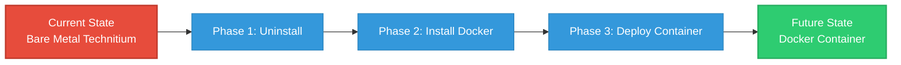

## 📖 Project Overview

This repository documents the complete migration of Technitium DNS from a bare metal installation on a Raspberry Pi to a Docker container. The goal was to containerize the DNS service for easier management, better resource isolation, and to establish a foundation for running multiple services on a single Raspberry Pi server. 

During this migration, the project also covered recovering from an SD card failure, flashing a fresh OS, and configuring remote management via SSH from a Windows 11 PC.

## 🏗️ Migration Architecture



## 📋 Project Phases

- [x] **Phase 1:** Uninstall bare metal Technitium DNS (and recover from SD card corruption)
- [x] **Phase 2:** Flash fresh Raspberry Pi OS Lite 64-bit & install Docker Engine
- [x] **Phase 3:** Deploy Technitium DNS via Docker Compose
- [x] **Phase 4:** Configure remote management & verify DNS resolution/blocklists
- [x] **Phase 5:** Whitelist router WAN IP to resolve recursion policy blocks

## 🚀 Quick Start Guide

### Prerequisites
- Raspberry Pi 4/5 running Raspberry Pi OS Lite 64-bit
- SSH access to your Raspberry Pi
- Windows 11 PC on the same local network

### Step 1: Install Docker on the Raspberry Pi
Update your system and install Docker Engine using the official convenience script.

```bash
sudo apt update && sudo apt upgrade -y
curl -fsSL https://get.docker.com -o get-docker.sh
sudo sh get-docker.sh
sudo usermod -aG docker $USER
```
*(Note: You must log out and log back in for the docker group changes to take effect).*

### Step 2: Clone this Repository
```bash
git clone https://github.com/Rziehlke/technitium-docker-migration.git
cd technitium-docker-migration
```

### Step 3: Configure Environment Variables
Create a `.env` file based on your preferences. 

```bash
nano .env
```
Add the following (replace with your secure password):
```env
ADMIN_PASSWORD=your_secure_password_here
DNS_SERVERS=1.1.1.1,8.8.8.8
```

### Step 4: Deploy the Container
Ensure you have the `docker-compose.yml` file in your directory, then start the container:

```bash
docker compose up -d
```

## ⚙️ Configuration Files

### docker-compose.yml
This file defines the Technitium DNS container, port mappings, and persistent volumes.

```yaml
version: '3.8'

services:
  technitium-dns:
    image: technitium/dns-server:latest
    container_name: technitium-dns
    restart: unless-stopped
    ports:
      - "5380:5380"
      - "53:53/udp"
      - "53:53/tcp"
    volumes:
      - ./config:/etc/technitiumdns/config
      - technitium-data:/var/lib/technitiumdns
    environment:
      - ADMIN_PASSWORD=${ADMIN_PASSWORD}
    networks:
      - dns-network

networks:
  dns-network:
    driver: bridge

volumes:
  technitium-data:
```

## 🧪 Testing & Verification

To test the DNS server, ensure you have the DNS utilities installed (`sudo apt install -y dnsutils`).

**Test basic resolution:**
```bash
dig @localhost google.com +short
```

**Test blocklists:**
1. Enable a blocklist in the Technitium Web GUI (`http://<PI_IP>:5380` -> Block Lists).
2. Query a known ad domain:
```bash
dig @localhost ads.google.com
```
*(A successful block will return `0.0.0.0` or an `NXDOMAIN` status).*

**View live logs:**
Access the Web GUI and navigate to **Logs** to see real-time queries, allowed requests, and blocked traffic.

## 🚨 Comprehensive Troubleshooting

During this migration, several issues were encountered and resolved. This section serves as a reference for common pitfalls.

### 1. OS & SD Card Issues

**Read-only file system warnings during `apt install`:**
*   **Error:** `Warning: Not using locking for read only lock file... Read-only file system`
*   **Cause:** The SD card filesystem was corrupted (likely due to power loss or wear), causing the Pi to mount it as read-only to protect data.
*   **Fix:** Temporarily remount with `sudo mount -o remount,rw /`. However, if `dmesg` shows ext4 errors, the SD card must be reflashed. Always shut down properly with `sudo shutdown -h now` before removing the SD card.

**Raspberry Pi Imager Offline Error:**
*   **Error:** `Unable to download OS list. You can still use a local image file.`
*   **Cause:** Network or SSL issues preventing the Imager from fetching the OS list.
*   **Fix:** Manually download the Raspberry Pi OS Lite 64-bit `.img` file from [raspberrypi.com](https://www.raspberrypi.com/software/operating-systems/). In the Imager, click "Choose OS" -> "Use custom image" and select the downloaded file.

### 2. SSH & Remote Access Issues

**Remote Host Identification Changed:**
*   **Error:** `WARNING: REMOTE HOST IDENTIFICATION HAS CHANGED! ... Host key verification failed.`
*   **Cause:** The Pi's SSH keys changed because the OS was reflashed. The Windows PC remembers the old key.
*   **Fix:** Run `ssh-keygen -R 192.168.86.10` (replace with your Pi's IP) in PowerShell, then reconnect and type `yes` to accept the new key.

### 3. Git & GitHub Issues

**Git Clone Authentication Failed:**
*   **Error:** `remote: Invalid username or token. Password authentication is not supported for Git operations.`
*   **Cause:** GitHub deprecated password authentication for command-line Git operations.
*   **Fix:** Make the repository public in GitHub settings, OR generate a Personal Access Token (PAT) in GitHub Developer Settings and use that token as your password when prompted.

### 4. Docker & Compose Issues

**`docker-compose: command not found`:**
*   **Cause:** Newer Docker versions integrate Compose as a plugin.
*   **Fix:** Use `docker compose` (with a space) instead of `docker-compose`. If that fails, install the plugin: `sudo apt install -y docker-compose-plugin`.

**`no configuration file provided: not found`:**
*   **Cause:** The `docker-compose.yml` file was not in the current directory.
*   **Fix:** Ensure you have `cd`'d into the `technitium-docker-migration` folder. If the file doesn't exist, create it using `nano docker-compose.yml`, paste the configuration, and save.

### 5. Command Line Tools

**`dig: command not found`:**
*   **Cause:** `dig` is not installed by default on Raspberry Pi OS Lite.
*   **Fix:** Install the DNS utilities package: `sudo apt update && sudo apt install -y dnsutils`.

### 6. Technitium DNS Configuration

**Router queries being blocked by Recursion Policy:**
*   **Error:** Router system queries show as blocked/refused in Technitium logs.
*   **Cause:** The router is querying the DNS server from its WAN (external) IP address. Technitium's default recursion policy blocks external clients to prevent DNS amplification attacks.
*   **Fix:** 
    1. Find the router's WAN IP in the Technitium Logs under the "Client" column.
    2. In Technitium Web GUI, go to **Settings** -> **Recursion**.
    3. Add the router's WAN IP to "Allow Recursion For These Networks".
    4. (Optional) Go to **Block Lists** -> **Allow List** tab and add the router IP to bypass blocklists for that specific client.

## 📈 Future Enhancements

- [ ] Add automated backup solution for Docker volumes
- [ ] Implement monitoring with Prometheus/Grafana

## 📄 License

This project is licensed under the MIT License.
```
